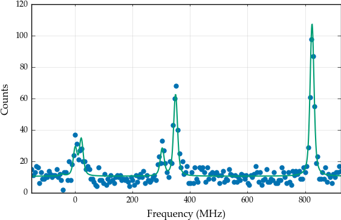

Fitting routines
================

For all methods, the underlying package LMFIT handles the parabolic
error calculations and passes along the optimization assignment to
SciPy.

Chisquare method
----------------

When fitting with the chisquare method, the costfunction to be minimized
is

.. math:: \chi^2 = \left(\frac{y_i-HFS(x_i)}{\sigma_i}\right)^2

with the subscript *i* referring to the datapoint, and *HFS* to the
response of the :class:`.HFSModel` class. The algorithm used is the
Levenberg-Marquardt algorithm, which gives quick results in a reliable
fashion. The :func:`.fitting.chisquare_model` function creates the
costfunction used for counting data. The function
:func:`.fitting.chisquare_fit` performs the actual fit, while
:func:`.fitting.chisquare_spectroscopic_fit` calculates the
uncertainty on the data by taking the square root of the number of
counts.

One of the options for :func:`.fitting.chisquare_model` is the keyword
*func*. This applies the given function to the *fitvalue* to calculate
the uncertainty on the datapoint. Setting this to the square root
function mimics the use of the Poisson distribution instead of the
Gaussian distribution for the uncertainty calculation.

In order to demonstrate the fit functions, toy data is needed. This is
created by assuming some parameters for the basemodel, calculating the
response, and then adding random noise.

.. code:: python

    %matplotlib inline

    import satlas as s
    import numpy as np
    s.set()
    np.random.seed(0)  #Ensure the same random numbers each time

    I = 1.0
    J = [1.0, 2.0]

    ABC = [100, 200, 100, 200, 0, 0]
    fwhm = [10, 10]
    centroid = 500
    scale = 100

    basemodel = s.HFSModel(I, J, ABC, centroid, fwhm=fwhm, scale=scale, background_params=[10], use_racah=True)

    frequency_range = (min(basemodel.locations) - 100, max(basemodel.locations) + 100)
    frequency_range = np.linspace(frequency_range[0], frequency_range[1], 200)

    data = np.floor(basemodel(frequency_range) + basemodel(frequency_range)**0.5 * np.random.randn(len(frequency_range)))

    success, message = s.chisquare_spectroscopic_fit(basemodel, frequency_range, data)
    print(success)
    print(message)
    basemodel.display_chisquare_fit(show_correl=False)
    basemodel.plot(x=frequency_range, y=data)

.. parsed-literal::

    C:\Anaconda3\lib\site-packages\IPython\html.py:14: ShimWarning: The `IPython.html` package has been deprecated. You should import from `notebook` instead. `IPython.html.widgets` has moved to `ipywidgets`.
      "`IPython.html.widgets` has moved to `ipywidgets`.", ShimWarning)
    Chisquare fitting done: 126it [00:00, 807.65it/s]

.. parsed-literal::

    True
    Tolerance seems to be too small.
    NDoF: 191, Chisquare: 204.74572, Reduced Chisquare: 1.0719671
    Errors not scaled with reduced chisquare.
    [[Variables]]
        FWHMG:         11.4052934 +/- 2.725367 (23.90%) (init= 11.40556)
        FWHML:         8.04020593 +/- 2.450075 (30.47%) (init= 8.040088)
        TotalFWHM:     16.3017438 +/- 1.350493 (8.28%)  == '0.5346*FWHML+(0.2166*FWHML**2+FWHMG**2)**0.5'
        Scale:         97.0923207 +/- 6.671103 (6.87%) (init= 97.09158)
        Saturation:    0 (fixed)
        Amp0__1:       0.2380726 (fixed)
        Amp1__1:       0.1786341 (fixed)
        Amp1__2:       0.535743 (fixed)
        Amp2__1:       0.01191064 (fixed)
        Amp2__2:       0.1786448 (fixed)
        Amp2__3:       1 (fixed)
        Al:            98.4456970 +/- 0.927711 (0.94%) (init= 98.44472)
        Au:            199.024103 +/- 0.568696 (0.29%) (init= 199.0234)
        Bl:            101.250852 +/- 0.636955 (0.63%) (init= 101.2501)
        Bu:            200.908034 +/- 0.963296 (0.48%) (init= 200.9071)
        Cl:            0 (fixed)
        Cu:            0 (fixed)
        Centroid:      499.893420 +/- 0.473148 (0.09%) (init= 499.8938)
        Background0:   10.5068608 +/- 0.311596 (2.97%) (init= 10.50687)
        N:             0 (fixed)

.. parsed-literal::

    C:\Anaconda3\lib\site-packages\matplotlib\figure.py:1744: UserWarning: This figure includes Axes that are not compatible with tight_layout, so its results might be incorrect.
      warnings.warn("This figure includes Axes that are not "

.. parsed-literal::

    (<matplotlib.figure.Figure at 0xbd83710>,
     <matplotlib.axes._subplots.AxesSubplot at 0xbdaad30>)

If *func=np.sqrt* is given to the fitfunction, the result is

.. code:: python

    basemodel = s.HFSModel(I, J, ABC, centroid, fwhm=fwhm, scale=scale, background_params=[50], use_racah=True)
    success, message = s.chisquare_spectroscopic_fit(basemodel, frequency_range, data, func=np.sqrt)
    print(success)
    print(message)
    basemodel.display_chisquare_fit(show_correl=False)
    basemodel.plot(x=frequency_range, y=data)

.. parsed-literal::

    Chisquare fitting in progress (204.745716227): 169it [00:00, 842.93it/s]

.. parsed-literal::

    True
    Tolerance seems to be too small.
    NDoF: 191, Chisquare: 204.74572, Reduced Chisquare: 1.0719671
    Errors not scaled with reduced chisquare.
    [[Variables]]
        FWHMG:         11.4046727 +/- 2.725470 (23.90%) (init= 11.40435)
        FWHML:         8.04079698 +/- 2.450016 (30.47%) (init= 8.040947)
        TotalFWHM:     16.3015558 +/- 1.350555 (8.28%)  == '0.5346*FWHML+(0.2166*FWHML**2+FWHMG**2)**0.5'
        Scale:         97.0921180 +/- 6.671372 (6.87%) (init= 97.09294)
        Saturation:    0 (fixed)
        Amp0__1:       0.2380726 (fixed)
        Amp1__1:       0.1786341 (fixed)
        Amp1__2:       0.535743 (fixed)
        Amp2__1:       0.01191064 (fixed)
        Amp2__2:       0.1786448 (fixed)
        Amp2__3:       1 (fixed)
        Al:            98.4445375 +/- 0.927717 (0.94%) (init= 98.4456)
        Au:            199.023681 +/- 0.568704 (0.29%) (init= 199.0244)
        Bl:            101.251172 +/- 0.636961 (0.63%) (init= 101.252)
        Bu:            200.907484 +/- 0.963299 (0.48%) (init= 200.9086)
        Cl:            0 (fixed)
        Cu:            0 (fixed)
        Centroid:      499.893321 +/- 0.473148 (0.09%) (init= 499.8928)
        Background0:   10.5068522 +/- 0.311595 (2.97%) (init= 10.50684)
        N:             0 (fixed)

.. parsed-literal::

    C:\Anaconda3\lib\site-packages\matplotlib\figure.py:1744: UserWarning: This figure includes Axes that are not compatible with tight_layout, so its results might be incorrect.
      warnings.warn("This figure includes Axes that are not "

.. parsed-literal::

    (<matplotlib.figure.Figure at 0xc63d5f8>,
     <matplotlib.axes._subplots.AxesSubplot at 0xc7c5160>)

which is slightly different.

Maximum Likelihood Estimation
-----------------------------

The Maximum Likelihood Estimation (MLE) can be used to derive the
chisquare method in the case of Gaussian uncertainties. When this is not
the case (as it is for counting data, which has a Poisson distribution),
a less simplified method has to be used.

The MLE method works by minimizing the negative loglikelihood. This is
calculated as

.. math:: -\mathcal{L}\left(\vec{\theta}\middle|x, y, \sigma\right) = \sum_i logp\left(\vec{\theta}\middle|x_i, y_i, \sigma_i\right)

For the function *logp*, the standard choice is the loglikelihood
derived from the Poisson distribution.

To use this method, the fitting routine code has to be changed to

.. code:: python

    basemodel = s.HFSModel(I, J, ABC, centroid, fwhm=fwhm, scale=scale, background_params=[10], use_racah=True)
    success, message = s.likelihood_fit(basemodel, frequency_range, data)
    print(success)
    print(message)
    basemodel.display_mle_fit(show_correl=False)
    basemodel.plot(x=frequency_range, y=data)

.. parsed-literal::

    Likelihood fitting done: 7196it [00:08, 864.65it/s]
    Finished Hessian calculation: 7it [00:02,  2.81it/s]

.. parsed-literal::

    True
    Converged (|f_n-f_(n-1)| ~= 0)
    Chisquare: 215.42358, Reduced Chisquare: 1.1278721
    Errors not scaled with reduced chisquare.
    [[Variables]]
        FWHMG:         10.0256994 +/- 2.832646 (28.25%) (init= 10.02534)
        FWHML:         9.11423613 +/- 2.316078 (25.41%) (init= 9.125287)
        TotalFWHM:     15.7585838  == '0.5346*FWHML+(0.2166*FWHML**2+FWHMG**2)**0.5'
        Scale:         99.9610437 +/- 6.736418 (6.74%) (init= 99.99098)
        Saturation:    0 (fixed)
        Amp0__1:       0.2380726 (fixed)
        Amp1__1:       0.1786341 (fixed)
        Amp1__2:       0.535743 (fixed)
        Amp2__1:       0.01191064 (fixed)
        Amp2__2:       0.1786448 (fixed)
        Amp2__3:       1 (fixed)
        Al:            98.4627333 +/- 0.835447 (0.85%) (init= 98.46572)
        Au:            199.006802 +/- 0.515486 (0.26%) (init= 198.9938)
        Bl:            101.344440 +/- 0.680162 (0.67%) (init= 101.2718)
        Bu:            200.970619 +/- 0.891733 (0.44%) (init= 200.8642)
        Cl:            0 (fixed)
        Cu:            0 (fixed)
        Centroid:      499.887536 +/- 0.468680 (0.09%) (init= 499.9266)
        Background0:   9.90564578 +/- 0.290065 (2.93%) (init= 9.918109)
        N:             0 (fixed)

.. parsed-literal::

    C:\Anaconda3\lib\site-packages\matplotlib\figure.py:1744: UserWarning: This figure includes Axes that are not compatible with tight_layout, so its results might be incorrect.
      warnings.warn("This figure includes Axes that are not "

.. parsed-literal::

    (<matplotlib.figure.Figure at 0xc791908>,
     <matplotlib.axes._subplots.AxesSubplot at 0xc7ad1d0>)

The uncertainties on the parameters can be estimated using a random walk
through parameter space, or the analytical boundaries can be calculated.
The random walk is explained in another tutorial. To estimate the
analytical bounds:

.. code:: python

    s.calculate_analytical_uncertainty(basemodel, frequency_range, data, method='mle')
    basemodel.display_mle_fit(show_correl=False)

.. parsed-literal::

    FWHMG (finding root): 4it [00:19,  4.26s/it]

By supplying a list of names under the *filter* keyword, the uncertainty
on only certain parameters can be estimated.

Note that, due to the fact that a fit is performed for every calculated
value for a parameter, the numbers given as the best fit might change
slightly. Convergence is also not guaranteed, so warning messages might
be displayed for some parameters.

Fitting with literature values
==============================

When using the :meth:`.BaseModel.set_literature_values` method to take
the known literature values into account, the fitting statistic is
adjusted in the following way:

1. The chisquare calculation
automatically adds the literature value as an extra datapoint, correctly
incorporating this in the calculation of the degrees of freedom. The new
chisquare formula is

.. math:: \chi^2 = \sum_i \left(\frac{y_i-f\left(x_i\right)}{\sigma_i}\right)^2 + \sum_{params} \left(\frac{p_{lit}-p_{fit}}{\sigma_{lit}}\right)^2

2. In the likelihood calculation, a Gaussian prior for the specified
parameters is used instead of a uniform one.

These methods are equivalent in the case of Gaussian distributions on
the datapoints for the likelihood calculation.

Likelihood reduced chisquare calculation
========================================

In the case of the likelihood calculations, deriving a statistic like
the :math:`\chi^2_{red}` is not as straightforward. One possibility is
using

.. math::

   \chi^2_{\mathcal{L}} = -2\mathcal{L}\left(y_i, f\left(x_i\right)\right)+2\mathcal{L}\left(y_i, y_i\right)

and this is also what is implemented in SATLAS

