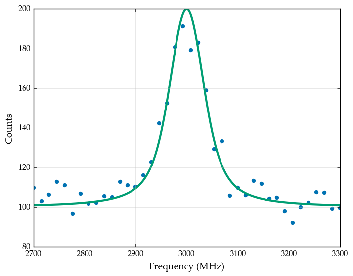
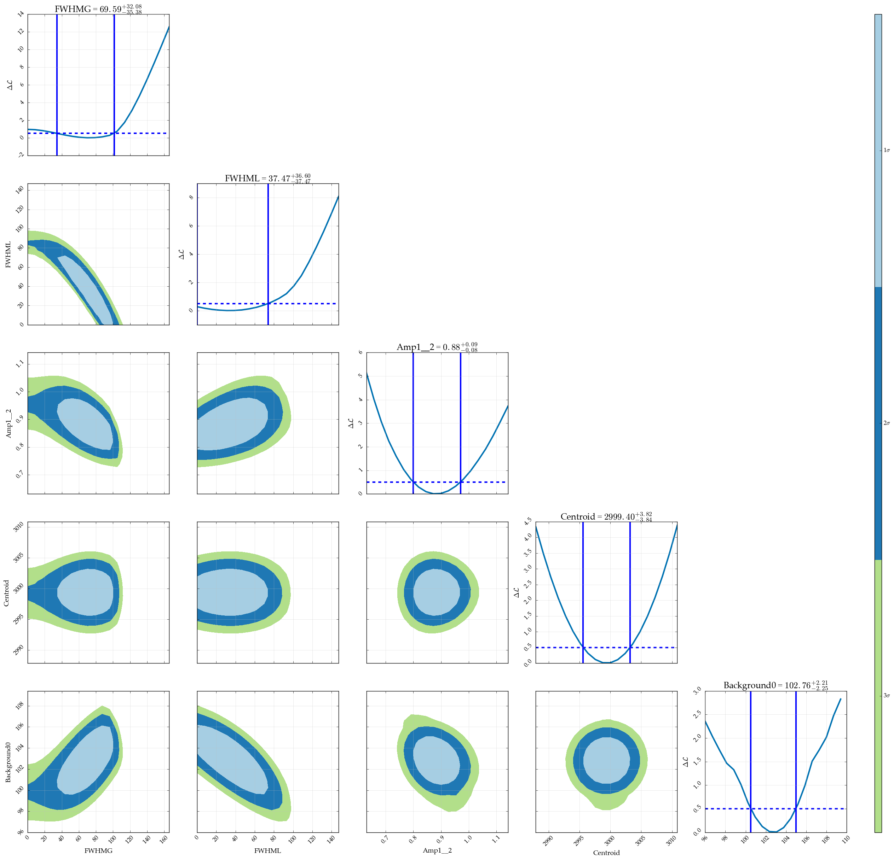

Estimating correlation through analytical calculations and random walk
======================================================================

Random walk versus analytical calculation
-----------------------------------------

When the uncertainty on the parameters has to be estimated for the case
of fitting through the loglikelihood, another option presents itself.

Using a random walk through parameter space, the distribution for each
parameter can be explored and used to estimate both the best value and
the uncertainty boundaries. This approach has the added advantage that
the code is more stable: using the analytical calculations, the repeated
fitting can slightly change the numbers involved, making the code a bit
more fragile. The disadvantage of the random walk is that convergence is
not guaranteed, nor can the number of steps needed be calculated
beforehand.

Another advantage of the random walk is that the correlation between
parameters is automatically calculated as well.

For the example dataset:

.. code:: python

    %matplotlib inline

    import satlas as s
    import numpy as np
    np.random.seed(0)

    I = 0
    J = [1.0, 2.0]

    ABC = [0, 0, 0, 0, 0, 0]
    df = 3000
    scale = 100
    background = [100]

    base = s.HFSModel(I, J, ABC, df, scale=scale, background_params=background)

    frequency = np.linspace(2700, 3300, 40)
    response = base(frequency) + 0.5*np.random.randn(frequency.size) * base(frequency)**0.5
    base.plot(x=frequency, y=response)

.. parsed-literal::

    C:\Users\MyStuff\Anaconda3\lib\site-packages\IPython\html.py:14: ShimWarning: The `IPython.html` package has been deprecated. You should import from `notebook` instead. `IPython.html.widgets` has moved to `ipywidgets`.
      "`IPython.html.widgets` has moved to `ipywidgets`.", ShimWarning)
    C:\Users\MyStuff\Anaconda3\lib\site-packages\matplotlib\__init__.py:872: UserWarning: axes.color_cycle is deprecated and replaced with axes.prop_cycle; please use the latter.
      warnings.warn(self.msg_depr % (key, alt_key))

Analytical correlation maps
---------------------------

To make analytical correlation maps and 1D likelihood parabola's, the
command is

.. code:: python

    s.likelihood_fit(base, frequency, response)
    s.generate_correlation_map(base, frequency, response, method='mle', resolution_diag=100, resolution_map=20)

.. parsed-literal::

    FWHMG: 100% ||                                                   | ETA:  0:00:00

    FWHML: 100% ||                                                   | ETA:  0:00:04

    Amp1__2: 100% ||                                                 | ETA:  0:00:01

    Centroid: 100% ||                                                | ETA:  0:00:00

    Background0: 100% ||                                             | ETA:  0:00:14

    FWHMG FWHML: 100% ||                                             | ETA:  0:00:09

    FWHMG Amp1__2: 100% ||                                  | ETA:  -1 day, 23:59:59

    FWHML Amp1__2: 100% ||                                           | ETA:  0:00:02

    FWHMG Centroid: 100% ||                                          | ETA:  0:00:00

    FWHML Centroid: 100% ||                                          | ETA:  0:00:00

    Amp1__2 Centroid: 100% ||                                        | ETA:  0:00:00

    FWHMG Background0: 100% ||                                       | ETA:  0:00:01

    FWHML Background0: 100% ||                                       | ETA:  0:00:01

    Amp1__2 Background0: 100% ||                                     | ETA:  0:00:18

    Centroid Background0: 100% ||                                    | ETA:  0:00:40

As can be seen here, the resolution of the correlation maps is clearly
visible. Since the resolution defines the number of datapoints on each
axis, the calculation time goes as :math:`N^2`, so increasing the
resolution increases the calculation time drastically.

Also clearly visible is the fact that the uncertainties are, at least in
some cases, non-gaussian. Especially in the FWHM of the profile and in
the background parameter, the deviation from a parabolic behaviour is
evident.

Generating and plotting random walks
------------------------------------

Initiating the random walk can be done by using the dedicated function,
or by passing the *walking=True* keyword to the likelihood fitting
method, which will automatically start the walk.

Due to memory concerns, the results from the random walk are saved in a
file in either the current directory if only the filename is given, or
in another directory if that location is also given.

The random walk algorithm employs the *emcee* package, and more details
on arguments for the walk algorithm can be found there.

.. code:: python

    s.likelihood_fit(base, frequency, response, walking=True, walk_kws={'filename': 'demonstration.h5', 'nsteps': 5000})
    s.generate_correlation_plot('demonstration.h5', bins=50)

.. parsed-literal::

    Walk:100% ||                                                     | ETA:  0:00:00
    Generating plots: 100% |\                                        | ETA:  0:00:00

.. image:: output_6_2.png

We see that the correlation plots show the same behaviour as in the
analytical case. A small one-bin peak is also still evident in most of
the plots. This might be the result of burnin (see the *emcee*
documentation for more information on this).

Comparison of the two methods
-----------------------------

The main difference between the two methods is that the analytical
method works by continuously fitting and refitting the data, while the
random walk judges the quality of each random step. This results in an
important distinction, namely that **the analytical method might not
converge**, while the random walk might get into a region where there is
no difference between random steps, and will there explore the entire
region, instead of being confined to the best fitting area. Both options
have their pros, cons and gotchas, and care needs to be taken in
selecting which method is to be used.

